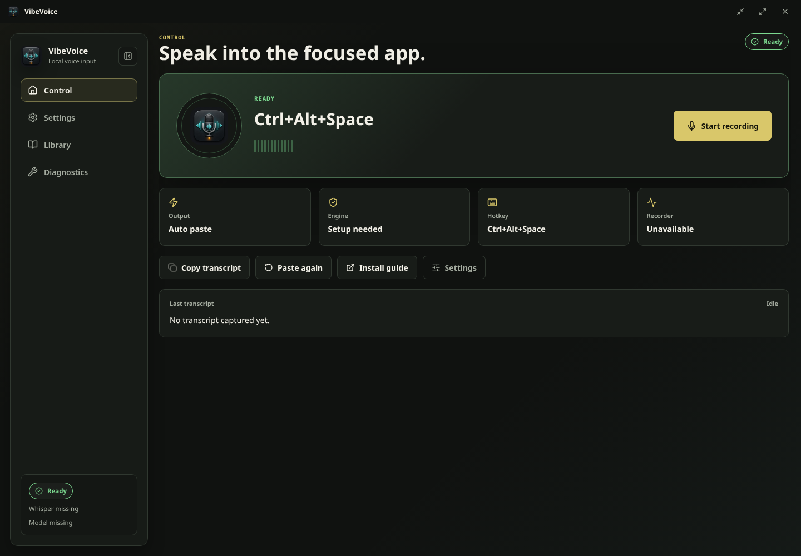
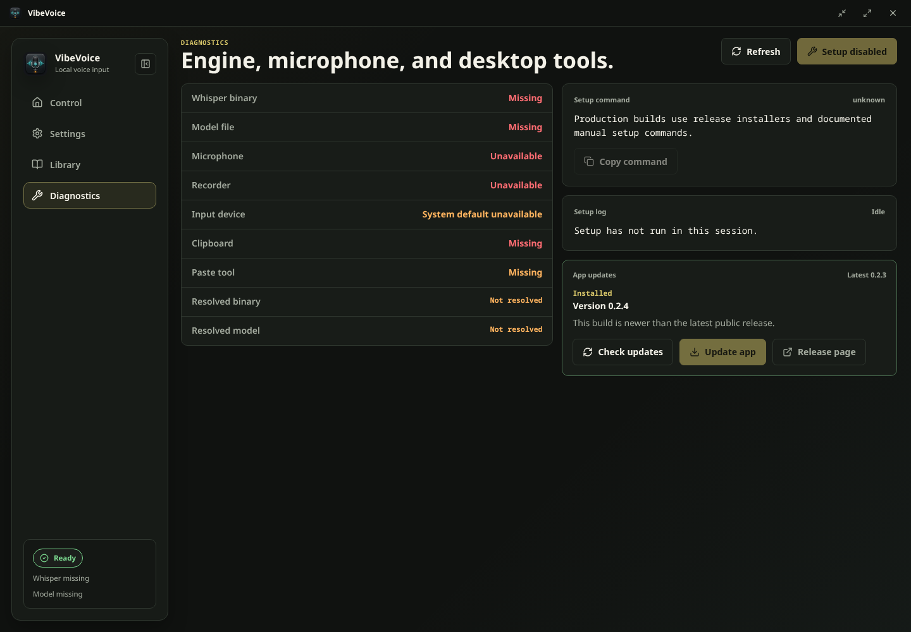
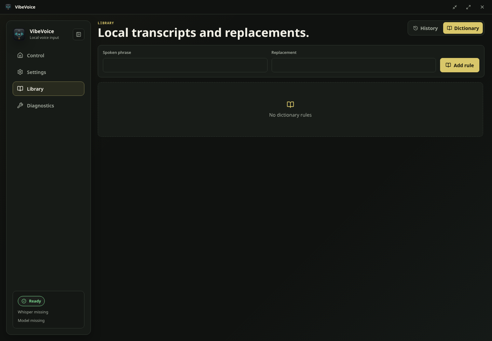

# VibeVoice

Local-first desktop voice input for developers. VibeVoice records from your microphone, transcribes with a local `whisper.cpp` engine, cleans developer terminology, and copies or pastes the result into the focused app.



## Highlights

- Native Tauri desktop app for Windows, Linux, and macOS
- Configurable floating pill for quick dictation from any app
- Local `whisper.cpp` transcription with automatic engine discovery
- Developer dictionary cleanup for terms such as TypeScript, GitHub Actions, and PostgreSQL
- Optional local transcript history, disabled by default for privacy
- Diagnostics for engine, microphone, paste tooling, and release updates
- Signed Tauri updater support through GitHub Releases when updater metadata is published

## Screens





## Quick Start

Install dependencies and run the desktop app:

```bash
cd app
npm install
npm run tauri dev
```

Install or verify the local Whisper engine:

```bash
bash scripts/install-engine.sh
bash scripts/check-system.sh
```

Windows setup:

```powershell
powershell -NoProfile -ExecutionPolicy Bypass -File .\scripts\install-windows.ps1
powershell -NoProfile -ExecutionPolicy Bypass -File .\scripts\check-windows.ps1
```

See [docs/INSTALL.md](docs/INSTALL.md) for complete platform setup and installer details.

## App Model

VibeVoice has two windows:

- Main app: Control, Settings, Library, and Diagnostics.
- Pill window: a compact floating recorder with drag, expand, paste-again, and app-open controls.

The recording pipeline is:

```text
hotkey or pill -> microphone capture -> local WAV -> whisper-cli -> cleanup -> clipboard/paste -> optional local history
```

Settings default to `auto` for both the Whisper binary and model path. The backend resolves explicit paths, environment variables, app-data engine installs, and legacy `~/tools/whisper.cpp` installs.

## Privacy

VibeVoice is local-first. Audio is recorded to a temporary local WAV, transcribed locally, and removed after processing. Transcript history is opt-in and stored as atomically replaced local JSON with a recovery backup when enabled.

## Updates

Diagnostics checks GitHub Releases and keeps the in-app updater available for all users. When a release includes signed updater metadata, VibeVoice can download and install it from the app. If updater metadata is unavailable, Diagnostics opens the release page for a manual installer.

## Release Notes

- Latest: [VibeVoice 0.2.6](docs/releases/v0.2.6.md)
- Previous: [VibeVoice 0.2.5](docs/releases/v0.2.5.md)

## Development Checks

```bash
npm --prefix app run build
cd app/src-tauri
cargo fmt --check
cargo check --no-default-features
cargo test --no-default-features
```

## Documentation

- [Architecture](docs/ARCHITECTURE.md)
- [Install](docs/INSTALL.md)
- [MVP Notes](docs/VIBEVOICE_MVP.md)
