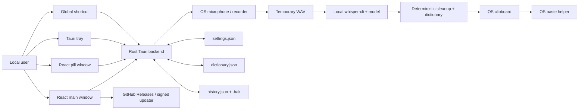
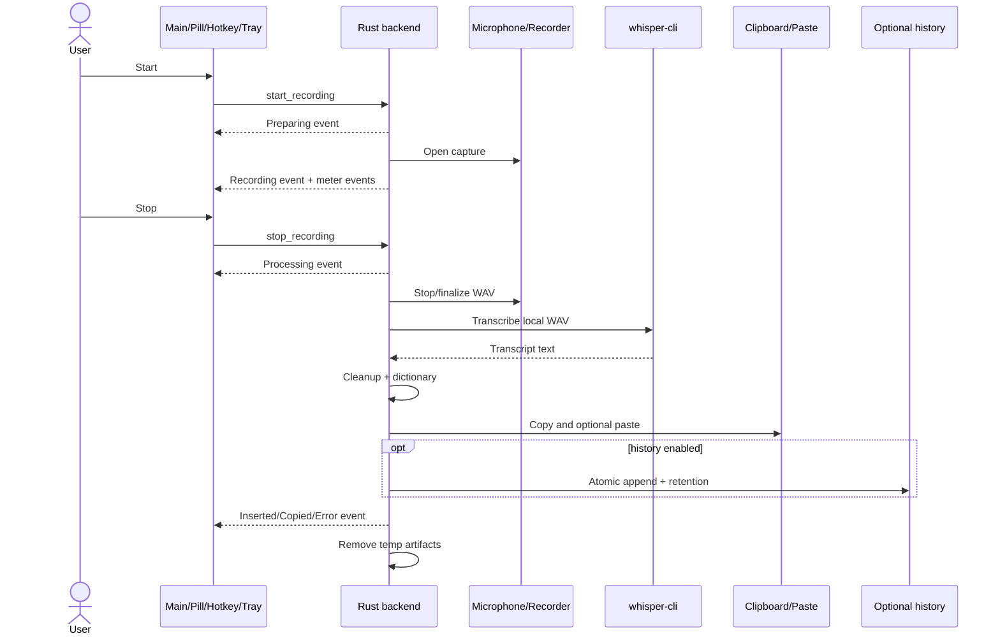

# VibeVoice — Product Specification and Engineering Handbook

**Document version:** 0.2.6  
**Last updated:** 2026-08-04  
**Generated or audited by:** Repository Product Specification & Engineering Handbook Agent  
**Repository:** `Zburgers/vibevoice`  
**Authoritative branch:** `master`  
**Verified branch commit:** `e833b36cbaabe8e6ba40b9a754320995b00e0473`  
**Working branch:** `docs/product-handbook-sync-2026-08-04`  
**Working branch commit:** Document publication commit; inspect Git file history (the commit cannot embed its own SHA)  
**Production status:** `VERIFIED_RELEASE_PRESENT` — public release documentation and release automation identify VibeVoice `0.2.6`; exact installed/deployed commit is unverified  
**Verified deployed commit:** `UNVERIFIED`  
**Deployment verification:** Repository release workflow, signed-updater configuration, and `docs/releases/v0.2.6.md`; no runtime/version endpoint or release-to-commit manifest was available  
**Document confidence:** High for authoritative-branch implementation; medium for cross-platform runtime behavior; low for installed-user state  
**Confidentiality:** Public repository documentation

---

## Document contract

This handbook is a repository-grounded audit of VibeVoice behavior plus proposed product contracts. It is not, by itself, an owner-approval record.

- **Part I separates observations, proposals, and explicitly approved decisions.** Only an entry with recorded owner, date, and approval provenance is normative.
- **Part II is descriptive.** It records what the authoritative `master` implementation actually does at the verified commit.
- A feature is not `SHIPPED` merely because it appears in an issue, plan, README, branch, or pull request.
- Unmerged work is marked `BRANCH_ONLY`.
- Production claims require release or runtime evidence.
- Ambiguity is recorded as an open ruling rather than silently resolved.
- Exact paths and symbols are preferred over broad architectural claims.
- Historical product documents remain useful evidence of intent but are superseded by this handbook where they conflict with current implementation evidence.

### Status vocabulary

- ✅ **SHIPPED** — implemented on the authoritative branch.
- 🔨 **BUILD** — approved behavior that is not fully implemented; without approval provenance, use **CANDIDATE** instead.
- ⚠️ **CHANGE** — existing behavior must deliberately change.
- ❌ **REMOVE** — existing behavior or artifact must be retired.
- 💡 **CANDIDATE — NOT APPROVED** — a possible future capability, not an implementation instruction.

### Evidence vocabulary

- `E1` — runtime verified.
- `E2` — integrated and meaningfully tested.
- `E3` — implemented on the authoritative branch.
- `E4` — partial, indirect, disabled, or missing important wiring.
- `E5` — documentary only.
- `E0` — contradicted by repository evidence.

### Documentation precedence

1. Separately recorded, owner-approved product decisions.
2. Executable implementation on the authoritative branch.
3. Tests and release automation.
4. Current narrow-purpose documents such as `docs/INSTALL.md`.
5. Historical planning documents such as `docs/VIBEVOICE_MVP.md`.
6. Open issues and pull requests.

`docs/VIBEVOICE_MVP.md` is retained as historical intent. It is not reliable evidence that a feature is shipped.

---

# Part I — Product Intent, Observed Constraints, and Proposed Contract

No owner approval record was available for this audit. The material in Part I is therefore repository-derived observation or proposal unless a section explicitly names approval provenance. It must not be treated as canonical product policy without that provenance.

## 1. Product definition

### 1.1 Product category

VibeVoice is a local-first, single-user desktop voice-input utility for developers. It converts microphone speech into text through a local `whisper.cpp` engine and inserts or copies the cleaned transcript into the user’s currently focused application.

### 1.2 Core problem

Developers often formulate prompts, documentation, issue descriptions, commit messages, and code-adjacent prose faster by speaking than typing. Existing shell scripts can transcribe speech but do not provide a dependable system-wide input experience, visible state, recovery controls, or platform packaging.

### 1.3 Primary user

A developer operating their own workstation on Windows, Linux, or macOS.

There are no accounts, organizations, remote tenants, administrators, billing actors, or server-side users.

### 1.4 Value proposition

```text
Trigger recording
→ speak naturally
→ transcribe locally
→ apply deterministic cleanup
→ copy or paste into the focused application
→ preserve a recoverable last transcript
```

### 1.5 Main product loops

1. **Quick dictation:** global hotkey or floating pill → record → transcribe → insert.
2. **Recovery:** failed insertion → transcript remains available → copy or paste again.
3. **Vocabulary maintenance:** review repeated mistakes → add or toggle a local dictionary rule.
4. **Local history:** opt in → review, export, reinsert, or delete previous transcripts.
5. **Readiness and updates:** inspect diagnostics → resolve engine/tooling problems → install signed application updates.

### 1.6 Explicit non-goals

VibeVoice is not:

- a cloud transcription service;
- a multi-user SaaS;
- a meeting recorder;
- an audio editor;
- a chatbot;
- an autonomous desktop agent;
- an always-listening assistant;
- a shell-command execution interface;
- a model marketplace;
- a hidden telemetry product;
- a subscription or payment product.

### 1.7 Trust assumptions

- The local operating-system account is trusted.
- The configured `whisper-cli` executable and model are trusted local artifacts.
- OS clipboard and synthetic paste tools are best-effort platform dependencies.
- GitHub Releases is trusted only for VibeVoice release discovery and signed updater artifacts.
- Transcript text may be sensitive and must remain local unless the user explicitly exports or pastes it elsewhere.

---

## 2. Actors, roles, and identity

### 2.1 Actors

| Actor | Identity model | Capabilities | Restrictions |
|---|---|---|---|
| Local user | Current OS session | Configure, record, transcribe, copy, paste, manage local history/dictionary, update app | No remote account or delegated access |
| Main renderer window | Tauri `main` webview | Full dashboard, settings, library, diagnostics, updater controls | Must not receive arbitrary shell or filesystem access |
| Pill renderer window | Tauri `pill` webview | Compact recording, paste-again, window movement, open-main controls | Should have least-privilege native capabilities |
| Rust backend | In-process Tauri core | Audio capture, process execution, local storage, hotkey, tray, clipboard, paste simulation | Must validate all renderer-provided values and URLs |
| Local Whisper engine | External process | Reads temporary WAV and model, writes transcript file | Must be bounded, cancellable, and cleaned up |
| Operating system | Platform boundary | Microphone, window focus, clipboard, process manager, temp/config paths | Behavior varies by platform and desktop environment |
| GitHub Releases | External network service | Update metadata and release pages | Must not receive transcript/audio/history data |

### 2.2 Capability matrix

| Capability | User | Main window | Pill window | Rust backend |
|---|---:|---:|---:|---:|
| Start/stop recording | Yes | Yes | Yes | Executes |
| Read transcript history | Yes | Yes | No direct view | Loads local JSON |
| Modify dictionary | Yes | Yes | No | Persists local JSON |
| Install app update | Yes | Yes | Not required | Updater plugin |
| Restart app | Yes | Yes | Not required | Process plugin |
| Write clipboard | Yes | Yes | Only through narrow app commands if needed | Clipboard plugin |
| Execute setup scripts | Development only | Diagnostics trigger | No | Debug-build gate |
| Open arbitrary URL | No | No | No | VibeVoice release URL allowlist only |

### 2.3 Identity and tenancy invariants

- There is exactly one logical user: the current OS account.
- No data may be read from or written to another remote user or tenant.
- No remote identity provider is required.
- The app must not claim account synchronization, remote backup, or cross-device history.

---

## 3. Product surfaces and navigation

### 3.1 Main window ✅ SHIPPED

**Implementation completeness:** FULL  
**Runtime state:** UNVERIFIED  
**Evidence strength:** E3  
**Confidence:** HIGH

The `main` Tauri window provides four navigation surfaces from `app/src/App.tsx` and `app/src/types.ts`:

- Control
- Settings
- Library
- Diagnostics

It uses custom title-bar controls and custom resize hit targets because Tauri decorations are disabled.

### 3.2 Floating pill ✅ SHIPPED

**Implementation completeness:** FULL  
**Runtime state:** UNVERIFIED  
**Evidence strength:** E3  
**Confidence:** HIGH

The `pill` window is transparent, undecorated, initially `68x68`, always-on-top by default, and omitted from the taskbar. It supports:

- drag;
- expand/collapse;
- record/stop/retry;
- elapsed-time and microphone-level display;
- paste last transcript again;
- open main app;
- monitor-aware expansion direction and work-area clamping.

### 3.3 Tray menu ✅ SHIPPED

**Implementation completeness:** FULL  
**Runtime state:** UNVERIFIED  
**Evidence strength:** E3  
**Confidence:** HIGH

The tray exposes:

- Show VibeVoice
- Show or Hide Pill
- Start or Stop Recording
- Quit VibeVoice

Left click or double click shows the main window.

### 3.4 Browser preview ⚠️ CHANGE

The Vite renderer can run outside Tauri, but only with fallback/mock state. Recording, persistence, updater, clipboard, and native window behavior are unavailable.

The browser preview must never be described as a functional VibeVoice runtime.

---

## 4. Core domain workflows

## 4.1 Application launch and readiness ✅ SHIPPED

**Implementation completeness:** FULL  
**Runtime state:** UNVERIFIED  
**Evidence strength:** E3  
**Confidence:** HIGH  
**Actors:** User, Tauri runtime, Rust backend, operating system  
**Preconditions:** Packaged app or `npm run tauri dev`

### Current behavior

`app/src-tauri/src/main.rs` calls `vibevoice_lib::run()`. `run()`:

1. registers Tauri global-shortcut, clipboard, process, and updater plugins;
2. initializes in-memory runtime, diagnostics cache, and history mutex state;
3. registers Tauri commands;
4. creates the tray;
5. loads the configured hotkey;
6. registers the global hotkey;
7. stores a startup error in runtime state if hotkey registration fails.

The React renderer mounts `App` through `app/src/main.tsx`, calls `get_app_state`, and subscribes to state and microphone-meter events.

### Failure behavior

- Hotkey registration failure is surfaced as `VoiceState::Error`.
- Missing engine/model/microphone is shown through diagnostics and blocks recording startup.
- The app can still render and provide settings/diagnostics when transcription prerequisites are missing.

### Evidence

- `app/src-tauri/src/main.rs`
- `app/src-tauri/src/lib.rs` — `run()`, `setup_tray()`, `register_global_hotkey()`
- `app/src/main.tsx`
- `app/src/App.tsx` — initial refresh and event listeners

---

## 4.2 Recording trigger and state machine ✅ SHIPPED

**Implementation completeness:** FULL for toggle mode  
**Runtime state:** UNVERIFIED  
**Evidence strength:** E3  
**Confidence:** HIGH  
**Actors:** User, main window, pill, tray, global hotkey, Rust backend

### Preconditions

- Valid `whisper-cli` and model paths.
- Available microphone/recorder.
- App is not already `Preparing`, `Recording`, or `Processing` in a conflicting way.

### Happy path

```text
Ready/Copied/Inserted/Error
→ Preparing
→ Recording
→ Processing
→ Inserted | Copied | Error | Ready
```

Triggers converge on `start_recording` or `stop_recording`:

- main Control button;
- pill Record/Stop button;
- global hotkey;
- tray Start or Stop Recording action.

### Constraints

- Only toggle mode is implemented.
- `recording_mode` is persisted but not consulted by the backend.
- Recording cannot begin while state is `Preparing` or `Processing`.
- A second start during active recording is rejected.
- Stopping during asynchronous preparation may return “Recording is still starting.”

### Evidence

- `app/src-tauri/src/lib.rs` — `begin_recording()`, `stop_recording()`, `register_hotkey_handler()`, `toggle_recording()`
- `app/src/App.tsx` — `handlePrimaryAction()`
- `app/src/types.ts` — `VoiceState`, `canStartOrStop()`

---

## 4.3 Microphone capture ✅ SHIPPED

**Implementation completeness:** FULL with platform-specific adapters  
**Runtime state:** UNVERIFIED  
**Evidence strength:** E3  
**Confidence:** HIGH

### Windows and macOS

Rust uses CPAL for the default input device and `hound` to write mono, 16-bit WAV data. Samples are converted to mono and a peak level is emitted to the frontend.

### Linux

The backend selects the first available recorder:

1. `pw-record`
2. `arecord`
3. `ffmpeg`

Linux records system-default input to a temporary WAV. The process receives SIGINT on stop, is polled for up to approximately two seconds, and is then killed if necessary.

### Temporary storage

Artifacts use:

```text
<std::env::temp_dir()>/vibevoice/recording-<uuid>.wav
<std::env::temp_dir()>/vibevoice/recording-<uuid>.txt
```

Normal completion removes both files.

### Known limitation

Abnormal termination can leave raw microphone WAV files indefinitely. See planned change C-002 and GitHub issue #47.

---

## 4.4 Local transcription ✅ SHIPPED

**Implementation completeness:** FULL but unbounded  
**Runtime state:** UNVERIFIED  
**Evidence strength:** E3  
**Confidence:** HIGH

### Current behavior

`transcribe()` resolves the engine and launches:

```text
whisper-cli
-m <model>
-f <audio.wav>
-otxt
-nt
-np
-of <output-prefix>
```

The transcript is read from `<output-prefix>.txt`.

### Engine resolution order

1. Existing explicit settings paths.
2. `VIBEVOICE_ENGINE_DIR`, `WHISPER_ROOT`, or `WHISPER_CPP_ROOT`.
3. User local data engine directories.
4. Legacy `~/tools/whisper.cpp`.
5. Current-directory candidates.

The default model is `ggml-base.en.bin`.

### Failure paths

- explicit binary/model path does not exist;
- no discovered binary or model;
- microphone unavailable;
- process fails to start;
- Whisper exits non-zero;
- transcript file is missing;
- transcript is empty.

### Known limitation

`Command::output()` has no timeout, cancellation, process-tree termination, or bounded recovery path. A hung Whisper process can leave the app permanently in `Processing`. See C-003 and issue #48.

---

## 4.5 Deterministic transcript cleanup ✅ SHIPPED

**Implementation completeness:** FULL  
**Runtime state:** UNVERIFIED  
**Evidence strength:** E2  
**Confidence:** HIGH

### Current behavior

`cleanup_transcript()`:

- removes empty lines;
- removes lines beginning with `[` that contain `-->`;
- trims lines;
- joins lines with spaces;
- collapses repeated whitespace.

If dictionary cleanup is enabled, `apply_dictionary()` performs enabled case-insensitive phrase replacement.

### Invariants

- No LLM is used.
- No cloud request is made.
- Cleanup must not summarize or intentionally rewrite meaning.
- The raw transcript is retained in history when history is enabled.

### Limitation

The replacement function uses byte slicing based on a lowercased string. Unicode case-folding can change byte length, so non-ASCII rules/input may be unsafe or incorrect. Current default rules are ASCII-oriented.

---

## 4.6 Clipboard copy and paste insertion ✅ SHIPPED

**Implementation completeness:** PARTIAL  
**Runtime state:** UNVERIFIED  
**Evidence strength:** E3  
**Confidence:** HIGH

### Current behavior

1. When `clipboard_fallback` is enabled, the final transcript is written through Tauri’s clipboard manager.
2. When `auto_paste` is enabled and copy succeeded, a platform-specific paste helper runs.
3. Runtime state becomes:
   - `Inserted` when paste succeeds;
   - `Copied` when copy succeeds but paste fails;
   - `Error` when no usable output action succeeds.

### Platform adapters

- Windows: PowerShell `System.Windows.Forms.SendKeys` sends `Ctrl+V`.
- Linux/Unix path: `wtype`, then `xdotool`, then `ydotool`.
- The current code does not define a dedicated macOS paste adapter; macOS falls through to Linux-style helper detection.

### Recovery

The latest transcript remains in runtime state. Main, pill, and history surfaces provide copy or paste-again actions.

### Known limitations

- Previous clipboard contents are overwritten and not restored.
- Paste target/focus is not verified.
- Paste helper execution has no timeout.
- There is no typed transaction identifier or concurrent-insertion lock.
- macOS paste behavior is not convincingly implemented by the authoritative branch.

Issue #36 proposes a transactional insertion model but remains a candidate until promoted.

---

## 4.7 Optional local history ✅ SHIPPED

**Implementation completeness:** FULL  
**Runtime state:** UNVERIFIED  
**Evidence strength:** E2  
**Confidence:** HIGH

### Current behavior

History is disabled by default. When enabled, a completed transcript stores:

- `id`
- `created_at`
- `raw_transcript`
- `final_transcript`
- `duration_ms`
- `insert_status`
- `error`

Data is stored in the app configuration directory as:

```text
history.json
history.json.bak
```

All read-modify-write paths use a process-local mutex. Writes use same-directory atomic replacement and `sync_all()`. Corrupt primary history is preserved as `history.corrupt-<timestamp>-<uuid>.json`, then restored from backup or replaced with an empty valid history.

### User operations

- view recent transcripts;
- select transcript;
- copy;
- paste again;
- delete one;
- clear all;
- export Markdown;
- export JSON;
- enable/disable persistence;
- configure maximum entries and age-based retention.

### Constraints

- Maximum accepted retention count is clamped to `1..=1000`.
- `history_retention_days = 0` means no age-based deletion.
- History locking is in-process only; multiple simultaneous app instances can still race.
- Disabling history hides stored entries through `get_app_state` behavior but does not delete previously stored history.

---

## 4.8 Local developer dictionary ✅ SHIPPED

**Implementation completeness:** PARTIAL  
**Runtime state:** UNVERIFIED  
**Evidence strength:** E3  
**Confidence:** HIGH

### Current behavior

The user can add, enable/disable, and delete local spoken-to-replacement rules. Rules are stored in `dictionary.json` under the app configuration directory.

If the file does not exist, the Rust backend generates hardcoded defaults from `default_dictionary()`.

### Drift

`config/default-dictionary.json` is tracked and `docs/ARCHITECTURE.md` claims it provides the default dictionary, but no authoritative-branch code loads that file. It is a documentary/dead configuration artifact.

See open ruling R-001.

---

## 4.9 Settings ✅ SHIPPED with partial fields

**Implementation completeness:** PARTIAL  
**Runtime state:** UNVERIFIED  
**Evidence strength:** E3  
**Confidence:** HIGH

Persisted settings:

- Whisper binary path;
- model path;
- global hotkey;
- recording mode;
- auto paste;
- clipboard fallback;
- dictionary cleanup;
- history enabled;
- maximum history entries;
- history retention days;
- pill always-on-top;
- start on login.

### Functional fields

All fields affect runtime behavior except:

- `recording_mode` — only `"toggle"` is exposed and backend behavior always toggles;
- `start_on_login` — persisted and displayed but no operating-system startup integration uses it.

These misleading fields must not be represented as fully operational.

---

## 4.10 Diagnostics and setup ✅ SHIPPED

**Implementation completeness:** FULL for readiness display; PARTIAL for support reporting  
**Runtime state:** UNVERIFIED  
**Evidence strength:** E3  
**Confidence:** HIGH

Diagnostics reports:

- binary found/missing;
- model found/missing;
- microphone availability;
- recorder;
- input device;
- clipboard tool;
- paste tool;
- resolved binary path;
- resolved model path;
- platform;
- setup command availability;
- last runtime error;
- installed application version;
- update status.

Diagnostics results are cached for five seconds by engine/model setting key.

### Setup execution policy

- In-app setup command execution is enabled only in debug builds.
- Production builds direct users to release installers or documented setup.
- A setup script must resolve within a trusted current-directory or resource-directory root.
- Release-page URLs are restricted to VibeVoice’s GitHub Releases root, tag, or download subpaths.

### Branch-only work

PR #35 adds a diagnostics-report copy feature and path redaction. It is not shipped on `master`.

---

## 4.11 Application updates ✅ SHIPPED

**Implementation completeness:** FULL  
**Runtime state:** VERIFIED_RELEASE_PRESENT  
**Evidence strength:** E2  
**Confidence:** MEDIUM

### Current behavior

The Diagnostics surface:

1. checks the Tauri updater endpoint for signed updater metadata;
2. when installable metadata exists, downloads, installs, and relaunches;
3. falls back to the GitHub latest-release API for informational version checking;
4. opens the VibeVoice release page when automated install is unavailable.

The configured endpoint is:

```text
https://github.com/Zburgers/vibevoice/releases/latest/download/latest.json
```

### Release packaging

`.github/workflows/release.yml` builds:

- Windows;
- Linux;
- macOS Apple Silicon.

Configured bundle targets include NSIS, MSI, DEB, RPM, AppImage, DMG, and app bundle formats.

### Known limitation

The fallback comparator on `master` is not SemVer compliant. PR #35 changes it, but the fix is branch-only.

---

## 5. Visibility and permission matrix

| Resource/action | Main window | Pill | Tray | Global hotkey | Backend enforcement |
|---|---:|---:|---:|---:|---|
| View current state | Yes | Yes | No | No | `get_app_state` command |
| Start/stop recording | Yes | Yes | Yes | Yes | Runtime-state checks |
| Copy latest transcript | Yes | No direct copy button | No | No | `copy_text` |
| Paste latest transcript | Yes | Yes | No | No | `insert_text` |
| View history | Yes | No | No | No | Local command state |
| Export history | Yes | No | No | No | Format allowlist |
| Modify dictionary | Yes | No | No | No | Tauri commands |
| Change settings | Yes | No | No | No | `save_settings` |
| Run setup script | Development builds | No | No | No | Debug-build and trusted-path checks |
| Install update | Yes | No | No | No | Main renderer plugin capability currently shared too broadly |
| Quit app | Window close/tray | No | Yes | No | Tauri runtime |

There are no remote permissions or tenant boundaries. Native window capabilities still require least-privilege separation; see C-001.

---

## 6. Business rules and invariants

### INV-001 — Local transcription

Audio and transcript generation must remain local in the default product path.

### INV-002 — No silent transcript loss

After successful transcription, the final text must remain recoverable through runtime state, clipboard, or history even if insertion fails.

### INV-003 — History is opt-in

No transcript may be persisted in history unless `history_enabled` is true.

### INV-004 — Raw audio is ephemeral

Raw WAV files must not be intentionally retained after processing. Crash leftovers are a defect, not expected behavior.

### INV-005 — Deterministic cleanup

Default cleanup must be deterministic and local. Any future model-backed rewriting requires a separate opt-in product decision.

### INV-006 — Explicit external effects

The app must not execute arbitrary shell commands or open arbitrary URLs from renderer input.

### INV-007 — Signed updates

Automated updates must use signed Tauri updater metadata. GitHub API fallback is informational and must not bypass signing.

### INV-008 — Safe persistence

Settings, dictionary, and history writes must not expose partial JSON as the final file. History recovery history must remain available.

### INV-009 — Honest settings

A visible setting must either affect behavior, be labelled unavailable, or be removed. Persisting an unused value is not sufficient.

### INV-010 — No hidden telemetry

No transcript, audio, clipboard text, target-window content, or personal vocabulary may be transmitted automatically.

---

## 7. Commercial model and resource economics

Not applicable.

VibeVoice has no plans, subscriptions, credits, billing, entitlements, remote quota, or payment flows.

Local resource costs include:

- microphone access;
- CPU and memory for Whisper;
- model and binary disk space;
- temporary WAV storage;
- local transcript/dictionary storage;
- optional network access for setup downloads and release updates.

---

## 8. Trust, abuse, fraud, and moderation

Traditional marketplace fraud/moderation is not applicable.

Relevant trust risks are:

- untrusted or replaced `whisper-cli` binaries;
- tampered model downloads;
- renderer compromise with overly broad Tauri capabilities;
- paste into the wrong focused target;
- raw audio persistence after crashes;
- transcript exposure through clipboard/history/export;
- diagnostics exposing local paths;
- unbounded external processes;
- unsafe future command-mode expansion.

No future feature may convert dictation phrases into arbitrary shell, filesystem, browser, or desktop actions without a separate security model and explicit confirmation.

---

## 9. Planned changes

## C-001 — Complete and release the 0.2.7 stabilization ⚠️ CHANGE

**Current behavior:** `master` remains version `0.2.6`; CSP is disabled, both renderer windows share broad capabilities, fallback version comparison is non-SemVer, diagnostics exposes full local paths, and renderer regression coverage is absent.

**Target behavior:** Merge and release the verified subset of PR #35 after its documented manual gates.

**Branch evidence:** PR #35, `fix/vibevoice-0.2.7-stabilization`, commit `c3932fd15b94d911f0a2ed433acbd31fe25fe2ad`.

**Included changes:**

- renderer visibility stabilization for issue #15;
- SemVer-safe fallback comparison for issue #34;
- diagnostics report with redaction for issue #8;
- CSP and separate main/pill capabilities for issue #33;
- native resize-cursor behavior;
- frontend test harness;
- version `0.2.7`.

**Required gates:**

- Linux graphical smoke test;
- at least ten real transcription cycles;
- pill expand/collapse and visible-control checks;
- all eight resize handles and cursors;
- Windows, Linux, and macOS CI/package validation;
- capability allowlist review;
- updater metadata validation.

**Success criteria:**

- no invisible controls after repeated cycles;
- pill cannot invoke updater/process privileges;
- diagnostics report contains no raw transcript or unredacted home path;
- stable/prerelease versions compare by SemVer;
- all branch tests pass;
- signed updater artifact is generated.

---

## C-002 — Reconcile orphaned temporary audio ⚠️ CHANGE

**Issue:** #47  
**Current behavior:** cleanup runs only after normal stop/processing completion.

**Target behavior:**

- private app-specific temp directory;
- startup reconciliation of stale `recording-*.wav` and transcript files;
- ownership/lock protection for active files;
- age threshold;
- cleanup metrics that never log content;
- tests for stale, recent, malformed, active, and permission-denied files.

**Security constraint:** Never delete outside the VibeVoice temp root.

**Success criteria:** Forced termination followed by relaunch removes abandoned sensitive audio without deleting an active recording owned by another live instance.

---

## C-003 — Bound and cancel transcription processes ⚠️ CHANGE

**Issue:** #48  
**Current behavior:** `whisper-cli` runs through blocking `Command::output()` without timeout or cancellation.

**Target behavior:**

- managed child process;
- bounded deadline derived from a conservative hard maximum;
- user-visible cancel action while processing;
- child/process-tree termination and reap;
- typed timeout/cancel error;
- guaranteed state recovery;
- guaranteed artifact cleanup or explicit retry retention contract.

**Success criteria:** A fixture that sleeps forever cannot keep VibeVoice in `Processing` beyond the configured deadline.

---

## B-001 — Make start-on-login honest 🔨 BUILD

**Current behavior:** `start_on_login` persists and the Settings toggle appears active, but no startup registration is implemented.

**Target behavior:** Use a supported cross-platform startup plugin or platform adapters, or temporarily remove/disable the control if full platform support is not approved.

**Compatibility:** Existing stored boolean values must not cause unexpected startup until implementation is explicitly enabled.

**Tests:**

- enable/disable idempotency;
- startup entry points to current executable;
- uninstall cleanup;
- unsupported platform behavior;
- permission failure;
- upgrade path.

---

## R-001 — Default dictionary source

**Status:** OPEN RULING REQUIRED

**Question:** Should the authoritative default dictionary be the Rust `default_dictionary()` implementation or `config/default-dictionary.json`?

**Why ambiguous:** The architecture document names the tracked JSON file, while executable code ignores it and constructs a different hardcoded list.

**Affected areas:**

- `app/src-tauri/src/lib.rs`
- `config/default-dictionary.json`
- `docs/ARCHITECTURE.md`
- packaging resources

**Implementation consequence:** Do not maintain two divergent default dictionaries. Choose one source, add a schema/version contract, test packaged loading, and remove or generate the other.

---

## R-002 — macOS paste contract

**Status:** OPEN RULING REQUIRED

**Question:** Is macOS a fully supported insertion platform for the current release?

**Why ambiguous:** Release automation builds macOS, CPAL captures macOS audio, but paste simulation has only an explicit Windows path and Linux helper path.

**Implementation consequence:** Either add and test a macOS adapter or document macOS as transcription/copy-only until paste support is proven.

---

## 10. Dependency-ordered build plan

## Phase 1 — Stabilization release gate

**Goal:** Convert PR #35 from branch-only to a verified release candidate.  
**Status items:** C-001  
**Why now:** Security capability separation, renderer reliability, diagnostics privacy, and updater correctness are prerequisites for further features.  
**Dependencies:** Current `master`, PR #35, release signing secrets.  
**Likely files:** `app/src/App.tsx`, `app/src-tauri/tauri.conf.json`, capabilities, tests, release workflow.  
**Security constraints:** Least privilege; no transcript/path leakage.  
**Out of scope:** New transcription features.  
**Suggested agent allocation:** One implementation/review agent plus one independent manual-QA agent.  
**Exit gate:** All documented manual and CI gates pass; release commit and artifacts are attributable.

## Phase 2 — Sensitive-process lifecycle hardening

**Goal:** Ensure recordings and transcription processes cannot outlive their safety bounds.  
**Status items:** C-002, C-003  
**Why now:** Raw audio retention and indefinite processing undermine local-first privacy and reliability.  
**Dependencies:** Phase 1 merged or rebased.  
**Likely files:** `app/src-tauri/src/lib.rs`, new process/temp modules, Rust tests.  
**Operational constraints:** Cross-platform process termination; no external effects during tests.  
**Success criteria:** crash cleanup, timeout, cancellation, state recovery, process reap, artifact cleanup.  
**Exit gate:** Fixture tests cover success, non-zero exit, timeout, ignored termination, child process, crash leftovers, and concurrent instance protection.

## Phase 3 — Settings and configuration truthfulness

**Goal:** Remove misleading settings and eliminate dual-source configuration drift.  
**Status items:** B-001, R-001, R-002  
**Dependencies:** Product rulings for dictionary and macOS support.  
**Likely files:** Settings model/UI, startup integration, dictionary loader, packaging resources, docs.  
**Compatibility:** Preserve existing `settings.json`; migration defaults must be safe.  
**Success criteria:** Every visible setting has tested runtime behavior or is visibly unsupported; exactly one default-dictionary source exists.  
**Exit gate:** Configuration matrix and runtime behavior agree on all supported platforms.

## Phase 4 — Reliability test baseline

**Goal:** Make critical behavior continuously verifiable on `master`.  
**Dependencies:** Phases 1–3.  
**Scope:**

- frontend unit/component tests;
- Rust process and persistence tests;
- packaged debug smoke build;
- Windows/Linux/macOS build matrix;
- deterministic state-machine tests;
- release-to-commit metadata.

**Success criteria:** Pull requests run meaningful checks even when not publishing; latest release records source SHA; handbook can distinguish branch, CI, and release state without inference.

---

## 11. Repository-derived decision log

The entries below are conclusions inferred from implementation, release, and historical-document evidence. They are not owner-approved product decisions: no approving owner, approval date, or source artifact was available in this repository. Reclassify them as normative only after that provenance is added.

### D-001

**Date:** 2026-08-04  
**Status:** OBSERVED — NOT OWNER-APPROVED
**Repository-derived conclusion:** VibeVoice remains local-first and does not require cloud transcription.
**Rationale:** Privacy, offline use, and predictable developer workflow are core product identity.  
**Rejected alternatives:** Cloud-first transcription as default.  
**Implementation consequences:** Local engine resolution, local model, no transcript upload.

### D-002

**Date:** 2026-08-04  
**Status:** OBSERVED — NOT OWNER-APPROVED
**Repository-derived conclusion:** VibeVoice is a single-user desktop utility, not a multi-user service.
**Implementation consequences:** No auth, tenants, server database, billing, or remote account state.

### D-003

**Date:** 2026-08-04  
**Status:** OBSERVED — NOT OWNER-APPROVED
**Repository-derived conclusion:** Toggle is the only shipped recording mode.
**Rationale:** Backend hotkey behavior ignores the persisted mode field.  
**Implementation consequences:** Do not advertise push-to-talk until implemented and tested.

### D-004

**Date:** 2026-08-04  
**Status:** OBSERVED — NOT OWNER-APPROVED
**Repository-derived conclusion:** Transcript history is opt-in and disabled by default.
**Implementation consequences:** A completed transcript may remain in volatile runtime state, but persistent history requires explicit user enablement.

### D-005

**Date:** 2026-08-04  
**Status:** OBSERVED — NOT OWNER-APPROVED
**Repository-derived conclusion:** Local JSON persistence is the current storage model.
**Rationale:** The authoritative implementation uses atomic JSON files, not the SQLite recommendation in the MVP document.  
**Implementation consequences:** Do not claim a database or migration system exists.

### D-006

**Date:** 2026-08-04  
**Status:** OBSERVED — NOT OWNER-APPROVED
**Repository-derived conclusion:** Windows/macOS capture uses CPAL; Linux uses runtime recorder binaries.
**Implementation consequences:** Linux readiness depends on `pw-record`, `arecord`, or `ffmpeg`.

### D-007

**Date:** 2026-08-04  
**Status:** OBSERVED — NOT OWNER-APPROVED
**Repository-derived conclusion:** Automated application updates require signed Tauri updater artifacts.
**Implementation consequences:** GitHub latest-release fallback remains informational.

### D-008

**Date:** 2026-08-04  
**Status:** OBSERVED — NOT OWNER-APPROVED
**Repository-derived conclusion:** In-app engine setup script execution is development-only.
**Implementation consequences:** Production directs users to release installers or documented setup commands.

### D-009

**Date:** 2026-08-04  
**Status:** OBSERVED — NOT OWNER-APPROVED
**Repository-derived conclusion:** Open feature issues without an implementation commitment remain candidates, not `BUILD` requirements.

---

## 12. Candidate product ideas

The following open issues describe plausible future capabilities but are not approved implementation requirements in this handbook:

| Issue | Candidate | Promotion conditions |
|---|---|---|
| #36 | Transactional insertion with clipboard restoration and recovery | Cross-platform adapter design, privacy review, target-verification limits |
| #37 | Adaptive developer vocabulary | Deterministic rule precedence, import schema, no silent learning |
| #38 | Spoken punctuation/layout/literal mode | Explicit grammar, literal escape, regression suite |
| #39 | Microphone/audio-quality preflight | False-positive policy, platform permissions, no always-on monitoring |
| #40 | Latest-transcript correction loop | History mutation contract, correction provenance |
| #41 | Engine/model installation lifecycle | Checksums, atomic activation, rollback, disk-space handling |
| #42 | Accessibility-first controls | Keyboard/screen-reader manual and automated validation |
| #43 | Bounded voice command mode | Separate mode, explicit confirmation, no arbitrary actions |
| #44 | Local privacy-preserving telemetry | Opt-in schema with no transcript/audio/path content |
| #10 | Cleanup presets | Deterministic transformations and profile contract |
| #11 | Model selection and benchmarking | Verified model discovery and bounded local benchmark |
| #12 | Recording profiles | Stable settings/profile schema and atomic switching |

Issue #45 is repository/profile marketing work, not a VibeVoice product capability.

---

# Part II — Descriptive Engineering Handbook

## 13. System architecture



### Runtime boundaries

- React renderers run in Tauri webviews.
- Rust backend owns local process, audio, persistence, hotkey, and tray behavior.
- Whisper and paste/recorder helpers are external child processes.
- No server, database service, queue, or remote application backend exists.
- GitHub network access is used for updates and installer downloads, not transcription.

### Trust boundaries

1. Renderer-to-Rust command boundary.
2. Rust-to-local executable boundary.
3. OS microphone/clipboard/focus boundary.
4. Local persistence boundary.
5. GitHub release/update boundary.

---

## 14. Repository layout

Verified against `e833b36cbaabe8e6ba40b9a754320995b00e0473`.

```text
.github/workflows/
  release.yml                    Multi-platform Tauri release workflow

app/
  package.json                   React/Vite/Tauri frontend manifest
  package-lock.json              Locked Node dependencies
  src/
    main.tsx                     React entry point
    App.tsx                      Renderer orchestration and command handlers
    PillWindow.tsx               Floating pill UI
    types.ts                     Shared renderer contracts and state helpers
    ui.tsx                       Shared UI primitives
    views/
      ControlView.tsx
      SettingsView.tsx
      LibraryView.tsx
      DiagnosticsView.tsx
    App.css                      Main and pill styling
  src-tauri/
    Cargo.toml                   Rust/Tauri manifest
    Cargo.lock                   Locked Rust dependencies
    tauri.conf.json              Windows, bundle, updater, CSP configuration
    capabilities/default.json    Shared main/pill native capability policy
    src/
      main.rs                    Native executable entry
      lib.rs                     Backend commands, audio, persistence, tests

config/
  default-dictionary.json        Tracked but not loaded by current backend

docs/
  ARCHITECTURE.md                Narrow architecture summary
  INSTALL.md                     Platform setup
  VIBEVOICE_MVP.md               Historical build directive
  releases/                      User-facing release notes
  assets/screenshots/            Product screenshots

scripts/
  install-engine.sh              Linux engine/dependency setup
  install-windows.ps1            Windows engine/dependency setup
  check-system.sh                Linux readiness check
  check-windows.ps1              Windows readiness check
  install-app.* / uninstall-app.* Packaging support
```

Open branch-only documentation:

- PR #46 adds root `ISSUES.md`; it is not on `master`.
- PR #35 adds `docs/issues.md` and `docs/releases/v0.2.7.md`; both are branch-only.

---

## 15. Technology stack

| Layer | Technology | Version/evidence |
|---|---|---|
| Desktop shell | Tauri | v2 manifest range |
| Native backend | Rust | Edition 2021 |
| Frontend | React | `^19.0.0` |
| Rendering/build | Vite | `^8.1.3` |
| Language | TypeScript | `^5.8.0` |
| UI icons | `lucide-react` | `^1.23.0` |
| Clipboard | `tauri-plugin-clipboard-manager` | v2 |
| Global shortcut | `tauri-plugin-global-shortcut` | v2 |
| Updater | `tauri-plugin-updater` | v2 |
| Process relaunch | `tauri-plugin-process` | v2 |
| Audio, Windows/macOS | CPAL | `0.15` |
| WAV writing | `hound` | `3` |
| Atomic persistence | `atomicwrites` | `0.4.4` |
| Serialization | `serde`, `serde_json` | current lockfile resolution |
| Time/IDs | `chrono`, `uuid` | manifest ranges |
| Linux recorder | `pw-record`, `arecord`, or `ffmpeg` | runtime dependency |
| Paste helpers | PowerShell SendKeys, `wtype`, `xdotool`, `ydotool` | runtime dependency |
| Transcription | external `whisper-cli` | local checkout |
| Model | `ggml-base.en.bin` | fixed default |
| CI/release | GitHub Actions + `tauri-apps/tauri-action@v0` | Node 22 + stable Rust |

No SQLite, PostgreSQL, Redis, web server, cloud worker, or remote API backend exists.

---

## 16. Application entry points and startup

### Native

`app/src-tauri/src/main.rs`:

```rust
fn main() {
    vibevoice_lib::run();
}
```

`app/src-tauri/src/lib.rs::run()` builds and starts Tauri.

### Renderer

`app/src/main.tsx` mounts `<App />` under `React.StrictMode`.

### Startup sequence

1. Tauri initializes plugins and managed state.
2. Tray is created.
3. Settings are read.
4. Global hotkey is registered.
5. Main and pill windows are created from `tauri.conf.json`.
6. Renderer calls `get_app_state`.
7. Renderer subscribes to:
   - `vibevoice-state-changed`
   - `vibevoice-meter-changed`
8. Diagnostics is refreshed on demand or when the Diagnostics tab opens.

### Shutdown

- Tray Quit calls `app.exit(0)`.
- Window Close closes the main window; tray and pill behavior may keep the process alive depending on platform/Tauri behavior.
- No explicit shutdown hook cleans an active recording or orphaned temp files.

### Health checks

There is no HTTP health endpoint. Diagnostics is the local readiness surface.

---

## 17. Domain model and local schema

### 17.1 Runtime state

```text
RuntimeState
- voice_state
- recording
- last_transcript
- last_error
- mic_level
```

Runtime state is in-memory and lost when the app exits.

### 17.2 Settings

```text
Settings
- whisper_binary_path: string
- model_path: string
- hotkey: string
- recording_mode: string
- auto_paste: boolean
- clipboard_fallback: boolean
- dictionary_cleanup: boolean
- history_enabled: boolean
- max_history_entries: usize
- history_retention_days: u32
- pill_always_on_top: boolean
- start_on_login: boolean
```

Stored as `settings.json`.

### 17.3 History item

```text
HistoryItem
- id: UUID string
- created_at: UTC timestamp
- raw_transcript: string
- final_transcript: string
- duration_ms: optional integer
- insert_status: string
- error: optional string
```

Stored as an array in `history.json`, with `history.json.bak`.

### 17.4 Dictionary rule

```text
DictionaryRule
- id: UUID string
- spoken: string
- replacement: string
- enabled: boolean
```

Stored as an array in `dictionary.json`.

### 17.5 No migration system

Serde defaults provide backward compatibility for missing Settings fields. There is no explicit local-data schema version or migration registry.

### 17.6 Drift risks

- unversioned settings/history/dictionary files;
- two competing default-dictionary sources;
- stringly typed `insert_status`;
- stringly typed `recording_mode`;
- multiple app instances can race on files because locking is process-local;
- exports are written under the config directory rather than a user-selected location.

---

## 18. Authentication and authorization

### Authentication

None. The OS session is the identity boundary.

### Authorization

Renderer access is controlled through Tauri capability files and command registration.

At the verified commit:

- both `main` and `pill` use `capabilities/default.json`;
- both receive clipboard write, process restart, updater, and broad window-management permissions;
- CSP is `null`.

This is excessive for the pill and is tracked by issue #33 and PR #35.

### Input validation

Implemented examples:

- release URL allowlist;
- history export format allowlist;
- explicit engine path existence checks;
- setup script trusted-root check;
- hotkey parsing;
- history count clamp.

Weak or missing examples:

- dictionary rule length/duplicate/boundary validation;
- settings numeric upper bound for retention days at backend boundary;
- typed recording mode validation;
- path redaction in current diagnostics;
- instance-level file ownership.

---

## 19. Backend architecture

The Rust backend is currently concentrated in `app/src-tauri/src/lib.rs`.

### Command layer

Registered commands:

| Command | Purpose | External effect |
|---|---|---|
| `get_app_state` | Return settings, diagnostics, history, dictionary, runtime state | Local reads |
| `refresh_diagnostics` | Recompute readiness | Local process/path probes |
| `save_settings` | Persist settings and re-register hotkey | Local write, hotkey mutation |
| `start_recording` | Begin asynchronous microphone preparation/capture | Microphone/process |
| `stop_recording` | Stop, transcribe, cleanup, insert | Process, clipboard, paste |
| `copy_text` | Write text to clipboard | Clipboard |
| `insert_text` | Copy and simulate paste | Clipboard, input simulation |
| `delete_history_item` | Remove one local record | Local write |
| `clear_history` | Replace history with empty list | Local write |
| `export_history` | Write Markdown/JSON export | Local write |
| `add_dictionary_rule` | Add local rule | Local write |
| `delete_dictionary_rule` | Remove local rule | Local write |
| `set_dictionary_rule_enabled` | Toggle local rule | Local write |
| `run_setup_script` | Run trusted setup in debug builds | Package/download/build process |
| `open_release_page` | Open allowlisted release URL | Browser process |
| `show_main_window` | Show or recreate main window | Window mutation |

### Service/domain boundaries

There is no separate service layer. Audio, persistence, engine resolution, OS integration, state machine, commands, and tests share one large module.

This is workable at MVP scale but increases change coupling and makes process-lifecycle testing harder.

Suggested future modules after behavior is stabilized:

```text
audio/
engine/
transcription/
insertion/
persistence/
diagnostics/
platform/
commands/
```

Do not refactor solely for file size; use behavior-driven boundaries.

---

## 20. Frontend architecture

### Routing

There is no URL router in Tauri. `activeTab` controls the main view. Browser-preview query parameters can select a tab or library mode.

### State management

React local state in `App.tsx` holds:

- app snapshot;
- active tab/library mode;
- update state;
- setup/command messages;
- selected history item;
- pill expansion and geometry state;
- settings path input buffers.

The Rust backend remains authoritative for persisted and recording state.

### Event model

- Full state refresh after `vibevoice-state-changed`.
- Direct microphone-level state patch after `vibevoice-meter-changed`.
- Recording elapsed time is computed locally each second.

### Error model

Most handlers convert exceptions into visible command/setup/update messages. Some dictionary/history operations do not wrap errors and may surface as unhandled rejected promises.

### Dead/orphaned UI behavior

- Start-on-login toggle has no backend effect.
- Recording-mode select contains only toggle and does not influence backend logic.
- Current main/pill capabilities are broader than each UI requires.

---

## 21. APIs and interfaces

VibeVoice has no HTTP API.

Its primary internal API is Tauri invocation plus event emission.

| Interface | Direction | Authentication | Side effects | Implementation |
|---|---|---|---|---|
| `invoke("get_app_state")` | Renderer → Rust | Tauri capability/registered command | Reads local state/files | `get_app_state` |
| `invoke("start_recording")` | Renderer → Rust | Same | Microphone/process | `start_recording` |
| `invoke("stop_recording")` | Renderer → Rust | Same | Transcription/clipboard/paste | `stop_recording` |
| `invoke("save_settings")` | Renderer → Rust | Same | File/hotkey | `save_settings` |
| `vibevoice-state-changed` | Rust → renderers | In-process event | Refresh trigger | `emit_state_changed` |
| `vibevoice-meter-changed` | Rust → renderers | In-process event | UI meter | `emit_meter_changed` |
| GitHub latest release API | Renderer → GitHub | Public | Network read | `refreshUpdateStatus` |
| Signed updater endpoint | Updater plugin → GitHub | Signature verification | Download/install/restart | Tauri updater |

---

## 22. Data flows and state machines

### Recording sequence



### Insert outcome state

```text
copy success + paste success     → Inserted
copy success + paste failure     → Copied + error detail
copy success + auto-paste off    → Copied
copy failure                     → Error
clipboard disabled + auto-paste  → Error because paste requires copy
both disabled                    → Ready with insert_status "none"
```

The “both disabled” outcome is technically allowed and may produce a transcript that exists only in runtime state/history. The UI should prevent or explicitly explain this configuration.

---

## 23. Background jobs and scheduling

There is no durable queue, scheduler, cron job, worker service, or background daemon.

In-process asynchronous work:

- `spawn_blocking` for recording preparation and finish/transcription;
- a dedicated writer thread for CPAL WAV output;
- a dedicated meter-emitter OS thread polling every 180 ms;
- Linux recorder child process;
- Whisper child process;
- paste helper child process.

### Restart behavior

- In-flight work is not durable.
- Recording/transcription state is lost on process exit.
- Temporary audio may remain.
- The app does not resume interrupted transcription.
- No operation depends on an LLM session.

### Recovery limitations

- no cancellation token;
- no transcription timeout;
- no startup temp reconciliation;
- no multi-instance lock;
- no process-level job journal.

---

## 24. External integrations

### 24.1 whisper.cpp

**Purpose:** Local transcription.  
**Authentication:** None.  
**Credential storage:** Not applicable.  
**Failure handling:** Exit status and transcript-file checks.  
**Timeout:** Missing.  
**Current status:** Required and implemented.

### 24.2 OS microphone

- CPAL on Windows/macOS.
- `pw-record`, `arecord`, or `ffmpeg` on Linux.
- Default input only.
- No input-device picker.

### 24.3 Clipboard and paste

- Tauri clipboard write.
- PowerShell SendKeys on Windows.
- `wtype`/`xdotool`/`ydotool` fallback elsewhere.
- No verified macOS adapter.

### 24.4 GitHub Releases

- Signed updater metadata.
- Latest release informational API.
- Allowlisted release-page opening.
- Release workflow publishes artifacts.

### 24.5 Setup package/download tooling

Linux script may use:

- `sudo dnf` or `sudo apt-get`;
- Git clone of `ggml-org/whisper.cpp`;
- upstream model download script;
- CMake build.

Production app does not execute setup scripts automatically.

---

## 25. Deployment and infrastructure

### Environments

- local development;
- GitHub Actions build environment;
- installed desktop release.

There is no hosted production service.

### Development commands

```bash
cd app
npm install
npm run tauri dev
```

### Canonical validation commands

```bash
npm --prefix app run build
cd app/src-tauri
cargo fmt --check
cargo check --no-default-features
cargo test --no-default-features
```

### Release trigger

`release.yml` publishes when:

- manually dispatched;
- a `v*` tag is pushed;
- `master` receives a commit whose message starts with `release: v`.

Pull requests do not execute the publish job because of the job-level condition.

### Release secrets

Names only:

- `TAURI_SIGNING_PRIVATE_KEY`
- `TAURI_SIGNING_PRIVATE_KEY_PASSWORD`
- generated `GITHUB_TOKEN`

### Rollback

No formal rollback runbook is present. Practical rollback is manual installation of an older signed release.

### Deployment drift

- Authoritative branch: version `0.2.6`.
- Latest documented release: `0.2.6`.
- Exact release source SHA: unverified.
- PR #35 version `0.2.7`: branch-only.
- Current master head contains post-release documentation workflow cleanup after the release lineage.

---

## 26. Observability and operations

### Available signals

- visible `VoiceState`;
- last runtime error;
- readiness diagnostics;
- resolved engine/model paths;
- recorder and input device;
- clipboard/paste tool;
- setup output;
- update state;
- history `insert_status` and error;
- `eprintln!` for stream/recovery errors.

### Missing signals

- structured logs;
- log levels and rotating file;
- correlation/operation IDs;
- typed failure categories;
- transcription duration metric separate from recording duration;
- process timeout/cancellation metrics;
- crash reporting;
- aggregate success/failure statistics;
- startup cleanup report;
- support bundle on `master`;
- release-to-source SHA shown in the app.

Any future telemetry must follow candidate #44 and remain local/opt-in unless separately approved.

---

## 27. Testing and validation

### Authoritative-branch Rust tests

`app/src-tauri/src/lib.rs` contains 11 unit tests covering:

1. explicit engine-path precedence;
2. automatic engine discovery;
3. copy success with paste failure;
4. clipboard failure;
5. native clipboard diagnostic;
6. release URL spoof rejection;
7. debug setup gate;
8. history retention;
9. Markdown export;
10. corrupt-history recovery;
11. serialized concurrent history mutation.

### Frontend tests

No frontend test script or test files are present on `master`.

PR #35 adds Vitest and reports:

- 5 frontend tests;
- 12 Rust tests;
- build/check/package validation.

Those results are branch claims and not authoritative-branch CI evidence.

### Release validation evidence

`docs/releases/v0.2.6.md` records frontend build, Rust format/check/test, and Windows/Linux/macOS release builds.

### Current verification limitations

- The repository connector cannot execute the code.
- No commit status checks were returned for current head.
- No real microphone, focus, paste, multi-monitor, or updater runtime smoke test was performed during this handbook generation.
- Release workflow’s publish job does not serve as general pull-request CI.

### Missing coverage

- microphone capture adapters;
- Linux recorder process handling;
- Whisper failure/hang/cancel;
- paste tools and focus loss;
- hotkey conflicts;
- tray/window lifecycle;
- renderer state cycles on master;
- settings migrations;
- multi-instance persistence;
- temp cleanup;
- packaged CSP/capabilities;
- updater end-to-end behavior.

---

## 28. Security and privacy

### Strengths

- local transcription;
- history disabled by default;
- normal-path raw-audio deletion;
- atomic history writes and recovery;
- allowlisted release URLs;
- debug-only setup execution;
- trusted-root validation for setup scripts;
- signed updater configuration;
- no embedded secrets;
- no cloud transcript API.

### Active risks

#### SEC-001 — CSP disabled

`tauri.conf.json` uses `"csp": null`.

#### SEC-002 — Shared broad capabilities

`capabilities/default.json` grants both windows updater, process restart, clipboard write, and broad window mutations.

#### SEC-003 — Sensitive path display

Diagnostics on `master` displays complete resolved binary/model paths.

#### SEC-004 — Raw audio crash retention

Temporary WAV files can survive abnormal shutdown.

#### SEC-005 — Unbounded child processes

Whisper and paste helpers have no general timeout/process-tree policy.

#### SEC-006 — Clipboard overwrite

User clipboard content is not preserved or restored.

#### SEC-007 — Multi-instance local-data race

Process-local mutexes do not protect against two app processes.

#### SEC-008 — Engine supply chain

Setup clones the current upstream whisper.cpp default branch and executes its model download/build flow without a pinned commit or checksum contract.

### Privacy inventory

Potentially sensitive local data:

- raw microphone WAV;
- raw transcript;
- cleaned transcript;
- custom vocabulary;
- clipboard text;
- local engine/model paths;
- exported history.

No code should log or upload these values by default.

---

## 29. Engineering conventions

Observed conventions:

- Rust owns consequential native behavior.
- React invokes narrow Tauri commands rather than shelling out.
- Settings use serde defaults for backward compatibility.
- IDs use UUID v4.
- Timestamps use UTC.
- History mutations use a shared mutex.
- JSON writes use atomic replacement.
- Async blocking work is moved off the renderer command path.
- Platform differences are selected with `cfg`.
- Errors are user-facing strings, not a typed error enum.
- UI state is refreshed from backend events.
- Browser preview uses explicit fallback state.
- Release versions are repeated in package, Cargo, Tauri config, and frontend fallback state.

Review expectations for future changes:

- update all version sources together;
- add tests for failure and recovery;
- do not claim cross-platform support without per-platform evidence;
- do not widen Tauri capabilities without a documented need;
- preserve local-first and no-hidden-telemetry invariants;
- update this handbook’s evidence and change history.

---

## 30. Known limitations, technical debt, and dead paths

| ID | Status | Severity | Category | Current behavior | Recommended direction |
|---|---|---:|---|---|---|
| L-001 | Open | Medium | Reliability | Whisper can hang indefinitely | C-003 / issue #48 |
| L-002 | Open | Medium | Privacy | Crash can retain raw WAV | C-002 / issue #47 |
| L-003 | Branch fix | Medium | Security | CSP disabled and capabilities shared | Merge verified PR #35 subset |
| L-004 | Branch fix | Medium | UI reliability | Controls may visually disappear after cycles | PR #35 + manual 10-cycle gate |
| L-005 | Branch fix | Low-Medium | Updater | Fallback comparator is not SemVer | PR #35 |
| L-006 | Open | Medium | Product honesty | Start-on-login toggle has no effect | B-001 |
| L-007 | Open | Low | Product drift | `recording_mode` field is ignored | Keep toggle-only or implement mode contract |
| L-008 | Open ruling | Medium | Configuration | Default dictionary has two sources | R-001 |
| L-009 | Open ruling | Medium | Platform parity | macOS paste adapter unverified | R-002 |
| L-010 | Open | Medium | Data safety | Multi-instance JSON mutation race | Single-instance lock or cross-process file lock |
| L-011 | Open | Low | UX | Exports go to config directory without picker | Add safe save-location flow |
| L-012 | Open | Low | Validation | Dictionary rules allow duplicates/overlaps | Schema and precedence rules |
| L-013 | Open | Medium | Supply chain | whisper.cpp install is unpinned/unchecksummed | Pin/verify install assets |
| L-014 | Open | Low | Architecture | Backend is concentrated in one large module | Split only alongside tested behavioral changes |
| L-015 | Open | Medium | CI | Publish workflow is not a complete PR CI gate | Add non-publishing validation jobs |
| L-016 | Dead configuration | Low | Documentation | `config/default-dictionary.json` is not loaded | Resolve R-001 |
| L-017 | Open | Medium | Output safety | Both output toggles can be disabled | Prevent or clearly explain runtime-only output |
| L-018 | Open | Low | Error handling | Some UI mutations lack local try/catch | Consistent error boundary/handler |
| L-019 | Open | Medium | Cleanup correctness | Unicode case-insensitive replacement can slice incorrectly | Unicode-safe matcher or ASCII contract |

---

## 31. Change history

### 2026-08-04 — Version 0.2.6

**Verified branch SHA:** `e833b36cbaabe8e6ba40b9a754320995b00e0473`  
**Verified deployed SHA:** `UNVERIFIED`  
**Comparison range:** Initial canonical handbook generation  
**New capabilities documented:** Current app, pill, tray, recording, transcription, insertion, history, dictionary, diagnostics, setup, updater  
**Changed behavior documented:** PR #35 branch-only stabilization  
**Resolved limitations recorded:** v0.2.6 history persistence, timer, pill geometry, resizing  
**New limitations recorded:** process timeout, crash audio retention, CSP/capabilities, settings drift, dictionary drift, macOS paste uncertainty  
**Repository-derived conclusions added:** D-001 through D-009
**Open rulings added:** R-001, R-002  
**Evidence strengthened:** Exact Rust commands, React surfaces, release workflow, local file contracts  
**Evidence weakened:** Exact deployed commit and installed cross-platform runtime remain unverified

---

# Appendices

## Appendix A — Feature evidence matrix

| Feature | Product status | Completeness | Runtime state | Evidence | Confidence | Primary implementation | Frontend | Persistence | Tests | Release verified | Known gaps |
|---|---|---|---|---|---|---|---|---|---|---|---|
| Main desktop shell | SHIPPED | FULL | UNVERIFIED | E3 | High | `tauri.conf.json`, `App.tsx` | Main window | N/A | No master UI tests | Yes, packaging | Renderer issue #15 |
| Floating pill | SHIPPED | FULL | UNVERIFIED | E3 | High | `PillWindow.tsx` | Pill window | Setting only | No master UI tests | v0.2.6 notes | Capability scope |
| Tray/global hotkey | SHIPPED | FULL toggle | UNVERIFIED | E3 | High | `setup_tray`, `register_hotkey_handler` | Tray/system | Hotkey setting | Hotkey parser indirect | No runtime proof | Conflicts/platform |
| Audio capture | SHIPPED | FULL adapters | UNVERIFIED | E3 | High | `start_audio_capture_impl` | Meter/status | Temp WAV | No adapter tests | Build evidence | Crash cleanup |
| Whisper transcription | SHIPPED | FULL unbounded | UNVERIFIED | E3 | High | `transcribe` | State/errors | Temp TXT | Engine resolution tests | Build evidence | Timeout/cancel |
| Cleanup | SHIPPED | FULL | UNVERIFIED | E2 | High | `cleanup_transcript`, `apply_dictionary` | Final transcript | History optional | Partial | Yes | Unicode matching |
| Copy/paste | SHIPPED | PARTIAL | UNVERIFIED | E3 | High | `copy_to_clipboard`, `paste_from_clipboard` | Main/pill/history | Last runtime text | Outcome tests | Build evidence | Focus, clipboard restore, macOS |
| History | SHIPPED | FULL | UNVERIFIED | E2 | High | history helpers | Library | JSON + backup | Strong unit tests | v0.2.6 | Multi-instance |
| Dictionary | SHIPPED | PARTIAL | UNVERIFIED | E3 | High | dictionary commands | Library | JSON | No rule tests | Build evidence | Dual source, validation |
| Diagnostics | SHIPPED | FULL readiness | UNVERIFIED | E3 | High | `diagnostics`, view | Diagnostics | None | Cache not tested | Build evidence | Path privacy |
| Dev setup | SHIPPED | FULL dev-only | UNVERIFIED | E2 | setup command/scripts | Diagnostics | Engine files | Gate/URL tests | N/A | Supply chain |
| Signed updater | SHIPPED | FULL | RELEASE_PRESENT | E2 | updater plugin/workflow | Diagnostics | Installed app | No master UI tests | v0.2.6 | Exact source SHA |
| Start on login | BUILD | STUB | UNREACHABLE | E4 | High | Setting only | Toggle | JSON | None | No | No OS integration |

---

## Appendix B — Route and surface matrix

| Surface | Actor | Backend command/service | Persistent model | Authorization/capability | Runtime state |
|---|---|---|---|---|---|
| Control | Local user | start/stop/copy/insert/get state | Settings, optional history | Main window capability | SHIPPED |
| Settings | Local user | save settings | `settings.json` | Main window | PARTIAL due unused fields |
| Library / History | Local user | delete/clear/export/copy/insert | `history.json` | Main window | SHIPPED |
| Library / Dictionary | Local user | add/toggle/delete rule | `dictionary.json` | Main window | SHIPPED |
| Diagnostics | Local user | refresh/setup/open release | None | Main window | SHIPPED |
| Update card | Local user | Tauri updater/process plugins | Installed application | Shared capability on master | SHIPPED, overprivileged |
| Pill collapsed | Local user | state events/window drag | Setting | Shared capability on master | SHIPPED |
| Pill expanded | Local user | start/stop/insert/show main | Runtime transcript | Shared capability on master | SHIPPED |
| Tray | Local user | window/record/quit handlers | Runtime | Native backend | SHIPPED |
| Global hotkey | Local user | start/stop | Hotkey setting | Native plugin | SHIPPED toggle-only |

---

## Appendix C — Configuration matrix

| Variable/setting | Required | Used by | Failure behavior | Production presence | Secret | Default safety |
|---|---|---|---|---|---|---|
| `VIBEVOICE_ENGINE_DIR` | Optional | Engine discovery/install | Fallback discovery | Unverified | No | Safe path override |
| `WHISPER_ROOT` | Optional | Engine discovery | Fallback discovery | Unverified | No | Safe if trusted |
| `WHISPER_CPP_ROOT` | Optional | Engine discovery | Fallback discovery | Unverified | No | Safe if trusted |
| `VIBEVOICE_MODEL_NAME` | Script optional | Linux installer | Defaults `base.en` | N/A | No | Could diverge from app fixed filename |
| `XDG_DATA_HOME` | Optional | Linux paths | Defaults `~/.local/share` | Environment dependent | No | Standard |
| `VIBEVOICE_TMP_DIR` | Script optional | Installer-created temp path | Defaults OS temp | Environment dependent | No | Must remain app-specific |
| `TAURI_SIGNING_PRIVATE_KEY` | Release required | GitHub Actions | Release signing fails | Present/absent unverified | Yes | No default |
| `TAURI_SIGNING_PRIVATE_KEY_PASSWORD` | Release required | GitHub Actions | Release signing fails | Present/absent unverified | Yes | No default |
| `whisper_binary_path` | Runtime optional | Backend | Auto discovery/error | Local JSON | No | `auto` |
| `model_path` | Runtime optional | Backend | Auto discovery/error | Local JSON | No | `auto` |
| `hotkey` | Runtime | Shortcut plugin | Error state | Local JSON | No | `Ctrl+Alt+Space` |
| `history_enabled` | Optional | Persistence | History hidden/not appended | Local JSON | No | `false` |
| `max_history_entries` | Optional | Retention | Clamped 1–1000 | Local JSON | No | `100` |
| `history_retention_days` | Optional | Retention | 0 means unlimited age | Local JSON | No | `0` |
| `pill_always_on_top` | Optional | Pill window | Window call may fail visibly | Local JSON | No | `true` |
| `start_on_login` | Optional | No runtime consumer | No effect | Local JSON | No | `false` |

---

## Appendix D — Repository drift report

### Documentation versus code

- `docs/VIBEVOICE_MVP.md` recommended SQLite; code uses atomic JSON.
- MVP required start-on-login; UI persists it but implementation is absent.
- MVP mentions recording modes; only toggle is implemented.
- `docs/ARCHITECTURE.md` claims `config/default-dictionary.json` supplies defaults; code ignores it.
- MVP did not require history export; code ships Markdown and JSON export.
- MVP initially positioned Linux/Windows; release automation also builds macOS.
- README describes local history accurately after v0.2.6.

### Authoritative branch versus working PRs

- PR #35 contains real `0.2.7` fixes but is draft and branch-only.
- PR #46 contains only an issues/optimization document; it does not remediate runtime issues.
- Neither PR may be classified as shipped.

### Authoritative branch versus release

- Both identify application version `0.2.6`.
- Exact release source commit is not recorded in an inspected runtime/version manifest.
- Current master head includes post-release docs workflow cleanup.

### Backend versus frontend

- Backend exports history and frontend exposes it.
- Backend persists start-on-login but does not apply it.
- Backend persists recording mode but behavior ignores it.
- Backend supports setup only in debug; frontend correctly disables production setup.
- Backend exposes full diagnostic paths; frontend displays them.

### Jobs defined versus running

No durable jobs or services exist.

### Integrations implemented versus configured

- Whisper must be locally installed; configuration is user/environment dependent.
- Linux recorder/paste helpers are runtime-discovered.
- Signed updater depends on published `latest.json`.
- macOS paste integration is unverified.

---

## Appendix E — Unresolved evidence gaps

1. Exact commit used to build the published `0.2.6` updater/installers.
2. Runtime behavior on installed Windows, Linux, and macOS builds.
3. Whether all configured bundle targets were published successfully.
4. Current release asset signatures and updater metadata availability.
5. Real microphone permission and device-disconnect behavior.
6. Real paste behavior across Wayland, X11, Windows, and macOS.
7. Main-window close versus process/tray lifecycle on each platform.
8. Multi-monitor and display-scale behavior outside release-note claims.
9. Whether multiple app instances can run concurrently.
10. CI status for the current master head.
11. Release signing secret presence and rotation policy.
12. Installed-user migration behavior from older settings/history schemas.

---

## Maintenance instruction

On every material repository change:

1. verify `master` head and release state;
2. compare changes from this document’s verified SHA;
3. re-audit recording, insertion, persistence, capabilities, update, and setup boundaries;
4. update statuses without marking branch-only work shipped;
5. preserve decision IDs and change history;
6. add exact evidence paths and tests;
7. record a new verified branch SHA and, when available, release/deployed SHA.
